# Лабораторна робота 2. Створення складних SQL запитів

## Загальна інформація

**Здобувач освіти:** [Зінькевич Олександра]
**Група:** [ІПЗ-31]
**Обраний рівень складності:** [3]

## Виконання завдань

### Рівень 1

#### 1. З'єднання таблиць

**Завдання 1.1:** INNER JOIN - список товарів з категоріями та постачальниками

```sql
SELECT p.product_name, c.category_name, s.company_name, p.unit_price
FROM products p
INNER JOIN categories c ON p.category_id = c.category_id
INNER JOIN suppliers s ON p.supplier_id = s.supplier_id
ORDER BY c.category_name, p.product_name;

```

**Результат виконання:**
```
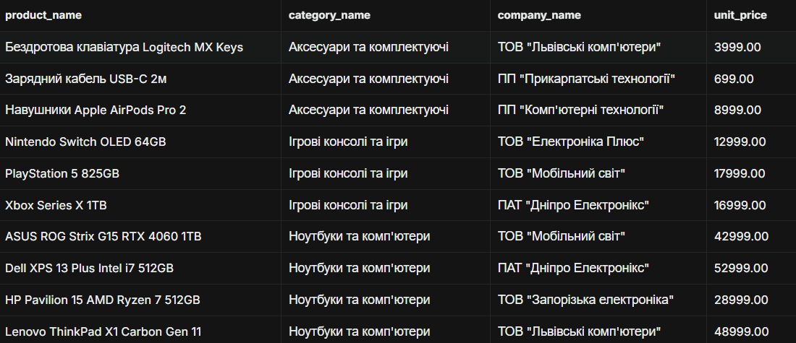

```

**Пояснення:** Запит з'єднує три таблиці: products, categories (за category_id) і suppliers (за supplier_id). INNER JOIN залишає лише товари, для яких є і категорія, і постачальник. Результат показує назву товару, категорію, постачальника та ціну, відсортовані за категорією й назвою.


**Завдання 1.2:** LEFT JOIN - клієнти з кількістю замовлень

```sql
SELECT c.contact_name, c.customer_type, r.region_name,
      COUNT(o.order_id) as order_count
FROM customers c
LEFT JOIN orders o ON c.customer_id = o.customer_id
LEFT JOIN regions r ON c.region_id = r.region_id
GROUP BY c.customer_id, c.contact_name, c.customer_type, r.region_name
ORDER BY order_count DESC;
```

**Результат виконання:**
```
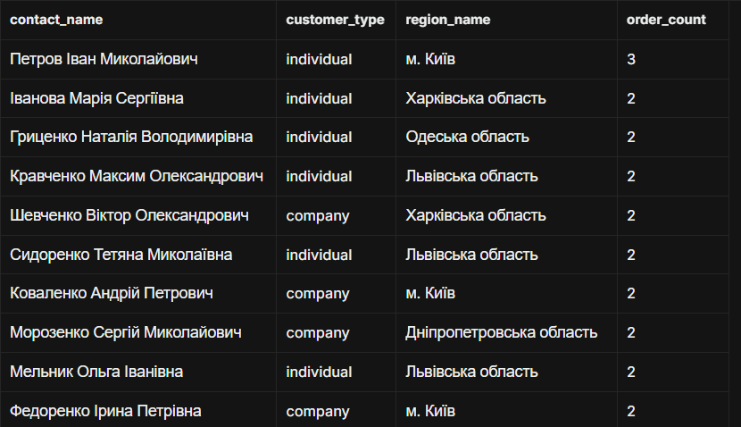

```

**Пояснення:** INNER JOIN повернув би лише клієнтів, які мають хоча б одне замовлення. LEFT JOIN зберігає всіх клієнтів, а для тих, хто нічого не замовляв, COUNT(o.order_id) дає 0. Тут найактивніший клієнт Петров Іван Миколайович (3 замовлення), решта в топі мають по 2. LEFT JOIN regions дає змогу показати клієнта, навіть якщо в нього не вказано регіон.


**Завдання 1.3:** Множинне з'єднання - детальна інформація про замовлення

```sql
-- Детальна інформація про замовлення: клієнт + товар + категорія + кількість
SELECT o.order_id, o.order_date, c.contact_name AS customer, p.product_name,
    cat.category_name, oi.quantity, oi.unit_price, oi.quantity * oi.unit_price AS line_total FROM orders o
INNER JOIN customers c ON o.customer_id = c.customer_id
INNER JOIN order_items oi ON o.order_id = oi.order_id
INNER JOIN products p ON oi.product_id = p.product_id
INNER JOIN categories cat ON p.category_id = cat.category_id
ORDER BY o.order_date DESC, o.order_id
LIMIT 30;

```

**Результат виконання:**
```
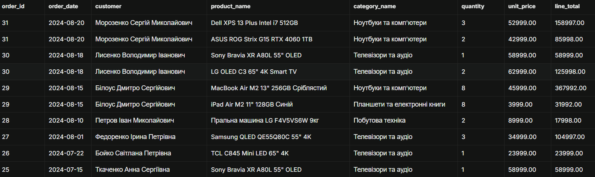

```

**Аналіз складності:** Запит складний: він з'єднує 5 таблиць і має обчислюваний стовпець line_total. Послідовність така:

1. Від orders через customers беремо ім'я клієнта.
2. Через order_items розгортаємо замовлення в рядки товарів.
3. Через products беремо назву товару.
4. Через categories беремо категорію.

Усі з'єднання INNER, бо кожен рядок замовлення має мати клієнта й товар. ORDER BY ... DESC разом з LIMIT 30 виводить 30 найновіших позицій, наприклад замовлення №31 від 2024-08-20. Для великих даних варто мати індекси на зовнішніх ключах.


#### 2. Агрегатні функції

**Завдання 2.1:** Статистика товарів за категоріями

```sql
SELECT c.category_name,
      COUNT(p.product_id) as product_count,
      AVG(p.unit_price) as avg_price,
      MIN(p.unit_price) as min_price,
      MAX(p.unit_price) as max_price
FROM categories c
LEFT JOIN products p ON c.category_id = p.category_id
GROUP BY c.category_id, c.category_name
ORDER BY product_count DESC;

```

**Результат виконання:**
```
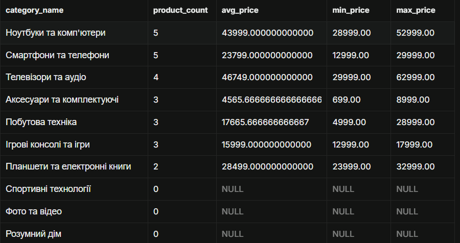

```

**Завдання 2.2:** Продажі за регіонами з використанням HAVING

```sql
-- Загальна сума продажів за регіонами (тільки доставлені замовлення)
SELECT
    r.region_name,
    COUNT(DISTINCT o.order_id) AS orders_count,
    SUM(oi.quantity * oi.unit_price) AS total_revenue
FROM orders o
INNER JOIN customers c ON o.customer_id = c.customer_id
INNER JOIN regions r ON c.region_id = r.region_id
INNER JOIN order_items oi ON o.order_id = oi.order_id
WHERE o.order_status = 'delivered'
GROUP BY r.region_id, r.region_name
HAVING SUM(oi.quantity * oi.unit_price) > 10000
ORDER BY total_revenue DESC;
```

**Результат виконання:**
```
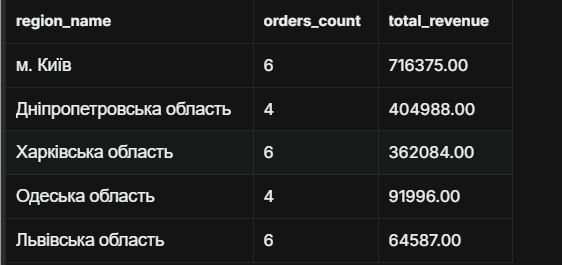

```

**Завдання 2.3:** Постачальники з кількістю товарів більше 2

```sql
-- Постачальники, які постачають більше 2 товарів
SELECT
    s.company_name,
    COUNT(p.product_id) AS product_count,
    AVG(p.unit_price) AS avg_price
FROM suppliers s
INNER JOIN products p ON s.supplier_id = p.supplier_id
GROUP BY s.supplier_id, s.company_name
HAVING COUNT(p.product_id) > 2
ORDER BY product_count DESC;

```

**Результат виконання:**
```
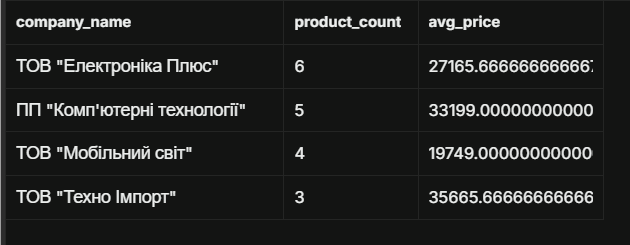

```


#### 3. Базові підзапити

**Завдання 3.1:** Товари з ціною вище середньої по категорії

```sql
SELECT p.product_name, p.unit_price, c.category_name
FROM products p
INNER JOIN categories c ON p.category_id = c.category_id
WHERE p.unit_price > (
    SELECT AVG(p2.unit_price)
    FROM products p2
    WHERE p2.category_id = p.category_id
)
ORDER BY c.category_name, p.unit_price DESC;

```

**Результат виконання:**
```
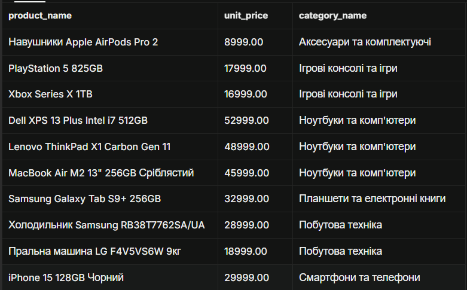

```

**Завдання 3.2:** Клієнти з замовленнями у 2024 році

```sql
-- Клієнти, які мали замовлення у 2024 році (підзапит з IN)
SELECT customer_id, contact_name, city
FROM customers
WHERE customer_id IN (
    SELECT customer_id
    FROM orders
    WHERE order_date >= '2024-01-01'
      AND order_date < '2025-01-01'
)
ORDER BY contact_name;
```

**Результат виконання:**
```
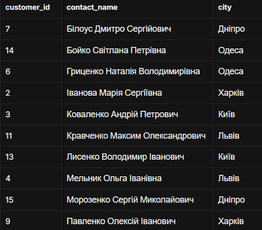

```

**Завдання 3.3:** Товари з загальною кількістю продажів

```sql
-- Кожен товар + загальна кількість проданих одиниць (підзапит у SELECT)
SELECT
    p.product_name,
    p.unit_price,
    (
        SELECT COALESCE(SUM(oi.quantity), 0)
        FROM order_items oi
        WHERE oi.product_id = p.product_id
    ) AS total_sold
FROM products p
ORDER BY total_sold DESC;
```

**Результат виконання:**
```
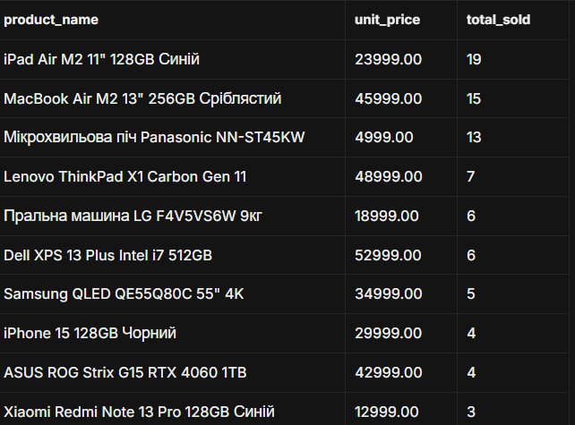

```


### Рівень 2

#### 4. Складні з'єднання

**Завдання 4.1:** RIGHT JOIN - аналіз категорій та товарів

```sql
SELECT c.category_name,
       COUNT(p.product_id) as products_count,
       COALESCE(AVG(p.unit_price), 0) as avg_price
FROM products p
RIGHT JOIN categories c ON p.category_id = c.category_id
GROUP BY c.category_id, c.category_name
ORDER BY products_count DESC;
```

**Результат виконання:**
```
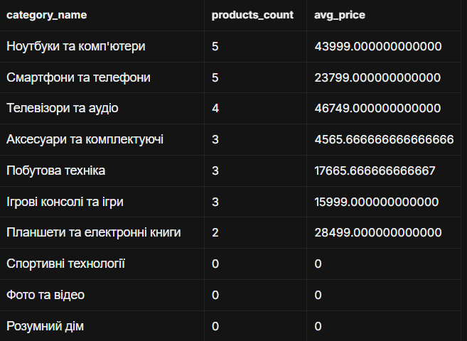

```

**Завдання 4.2:** Self-join - співробітники та керівники

```sql
SELECT e1.first_name || ' ' || e1.last_name as employee,
       e1.title as employee_title,
       e2.first_name || ' ' || e2.last_name as manager,
       e2.title as manager_title
FROM employees e1
LEFT JOIN employees e2 ON e1.reports_to = e2.employee_id
ORDER BY e2.last_name, e1.last_name;

```

**Результат виконання:**
```
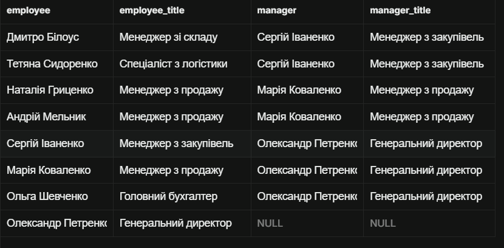

```

**Завдання 4.3:** Запит з умовним з'єднанням (з додатковими умовами в ON)

```sql
-- Клієнти + їхні замовлення ТІЛЬКИ за 2024 рік (умова в ON)
SELECT c.contact_name,
       c.customer_type,
       o.order_id,
       o.order_date,
       o.freight
FROM customers c
LEFT JOIN orders o ON c.customer_id = o.customer_id
                  AND o.order_date >= '2024-01-01'
                  AND o.order_date < '2025-01-01'
ORDER BY c.contact_name, o.order_date;

```

**Результат виконання:**
```
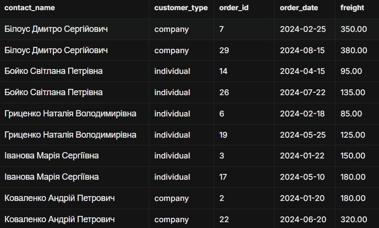

```


#### 5. Віконні функції

**Завдання 5.1:** Ранжування товарів за ціною в категоріях

```sql
SELECT p.product_name,
       c.category_name,
       p.unit_price,
       RANK() OVER (PARTITION BY c.category_name ORDER BY p.unit_price DESC) as price_rank,
       DENSE_RANK() OVER (PARTITION BY c.category_name ORDER BY p.unit_price DESC) as price_dense_rank,
       ROW_NUMBER() OVER (PARTITION BY c.category_name ORDER BY p.unit_price DESC) as row_num
FROM products p
JOIN categories c ON p.category_id = c.category_id
ORDER BY c.category_name, p.unit_price DESC;

```

**Результат виконання:**
```
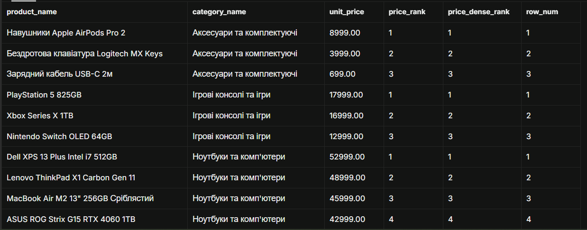

```

**Завдання 5.2:** Порівняння замовлень з попередніми датами

```sql
-- Для кожного замовлення: попередня і наступна дата замовлення цього ж клієнта
SELECT
    customer_id,
    order_id,
    order_date,
    LAG(order_date) OVER (
        PARTITION BY customer_id
        ORDER BY order_date
    ) AS prev_order_date,
    LEAD(order_date) OVER (
        PARTITION BY customer_id
        ORDER BY order_date
    ) AS next_order_date,
    order_date - LAG(order_date) OVER (
        PARTITION BY customer_id
        ORDER BY order_date
    ) AS days_since_prev
FROM orders
ORDER BY customer_id, order_date;

```

**Результат виконання:**
```
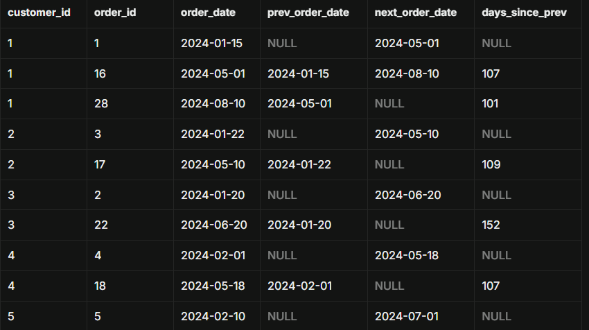

```

**Завдання 5.3:** запити з PARTITION BY для аналізу в розрізах

```sql
-- Кожен товар + середня ціна в його категорії + відхилення від неї
SELECT
    p.product_name,
    c.category_name,
    p.unit_price,
    AVG(p.unit_price) OVER (PARTITION BY c.category_id) AS category_avg_price,
    p.unit_price - AVG(p.unit_price) OVER (PARTITION BY c.category_id) AS diff_from_avg,
    ROUND(
        100.0 * (p.unit_price - AVG(p.unit_price) OVER (PARTITION BY c.category_id))
        / AVG(p.unit_price) OVER (PARTITION BY c.category_id),
        1
    ) AS diff_percent
FROM products p
JOIN categories c ON p.category_id = c.category_id
ORDER BY c.category_name, p.unit_price DESC;

```

**Результат виконання:**
```
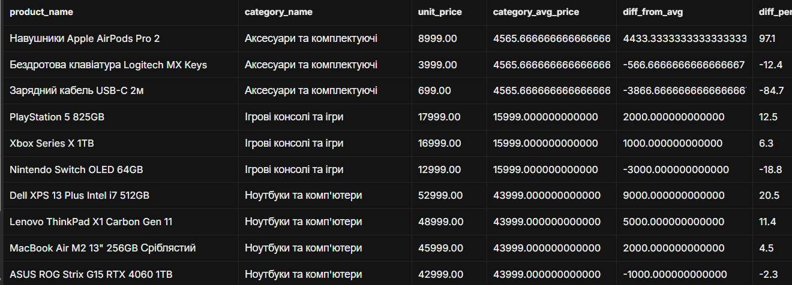

```


### Рівень 3

#### 6. Матеріалізовані представлення та рекурсивні запити

**Завдання 6.1:** Матеріалізоване представлення для аналізу продажів

```sql
CREATE MATERIALIZED VIEW mv_monthly_sales AS
SELECT
    EXTRACT(YEAR FROM o.order_date) as year,
    EXTRACT(MONTH FROM o.order_date) as month,
    c.category_name,
    r.region_name,
    SUM(oi.quantity * oi.unit_price * (1 - oi.discount)) as total_revenue,
    COUNT(DISTINCT o.order_id) as orders_count,
    AVG(oi.quantity * oi.unit_price * (1 - oi.discount)) as avg_order_value
FROM orders o
JOIN order_items oi ON o.order_id = oi.order_id
JOIN products p ON oi.product_id = p.product_id
JOIN categories c ON p.category_id = c.category_id
JOIN customers cu ON o.customer_id = cu.customer_id
LEFT JOIN regions r ON cu.region_id = r.region_id
WHERE o.order_status = 'delivered'
GROUP BY year, month, c.category_name, r.region_name;

-- Створення індексу для матеріалізованого представлення
CREATE INDEX idx_mv_monthly_sales_date ON mv_monthly_sales(year, month);

```

**Пояснення:** Матеріалізоване представлення фізично зберігає результат складного запиту (5 з'єднань і агрегація).

Переваги:

- Швидке читання, бо агрегація не перераховується щоразу.
- Можна створювати індекси (тут idx_mv_monthly_sales_date).
- Менше навантаження на основні таблиці.

Недолік у тому, що дані застаріють, тому їх треба оновлювати командою REFRESH MATERIALIZED VIEW mv_monthly_sales;. Воно підходить для звітності та аналітики, де свіжість даних до секунди не потрібна.

**Завдання 6.2:** Рекурсивний запит для ієрархії співробітників

```sql
WITH RECURSIVE employee_hierarchy AS (
    -- Базовий випадок: топ-менеджери (без керівника)
    SELECT employee_id, first_name, last_name, title, reports_to,
          0 as level,
          CAST(last_name || ' ' || first_name as VARCHAR(1000)) as hierarchy_path
    FROM employees
    WHERE reports_to IS NULL

    UNION ALL

    -- Рекурсивний випадок: підлеглі
    SELECT e.employee_id, e.first_name, e.last_name, e.title, e.reports_to,
          eh.level + 1,
          CAST(eh.hierarchy_path || ' -> ' || e.last_name || ' ' || e.first_name as VARCHAR(1000))
    FROM employees e
    JOIN employee_hierarchy eh ON e.reports_to = eh.employee_id
)
SELECT * FROM employee_hierarchy
ORDER BY hierarchy_path;
```

**Результат виконання:**
```
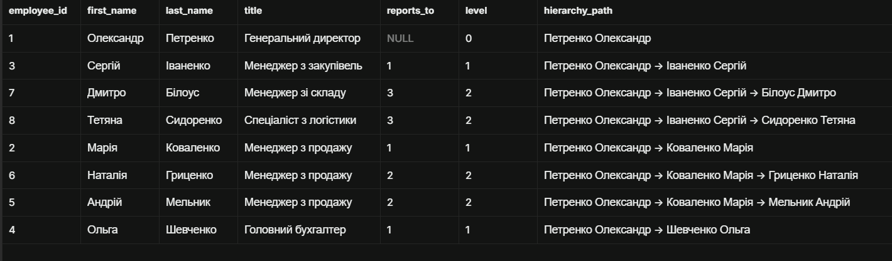 

```

**Завдання 6.3:** Збережена процедура для параметризованої аналітики

```sql
-- Процедура: статистика товарів за категорією та ціновим діапазоном
CREATE OR REPLACE FUNCTION get_category_stats(
    p_category_id INT,
    p_min_price NUMERIC,
    p_max_price NUMERIC
)
RETURNS TABLE (
    product_name TEXT,
    unit_price NUMERIC,
    units_in_stock INT
) AS $$
BEGIN
    RETURN QUERY
    SELECT p.product_name::TEXT, p.unit_price, p.units_in_stock
    FROM products p
    WHERE p.category_id = p_category_id
      AND p.unit_price BETWEEN p_min_price AND p_max_price
    ORDER BY p.unit_price DESC;
END;
$$ LANGUAGE plpgsql;

-- Товари категорії 1 з ціною від 5000 до 30000
SELECT * FROM get_category_stats(1, 5000, 30000);

```

**Результат виконання:**
```
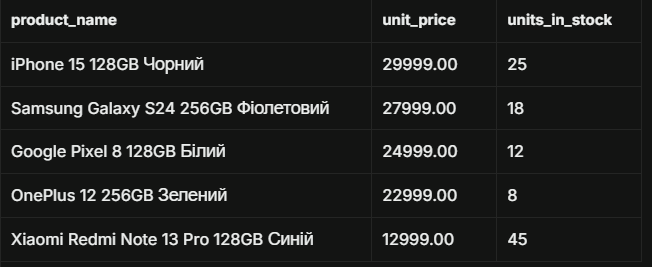 

```


## Аналіз продуктивності

### Дослідження планів виконання

**Найповільніший запит:**
```sql
EXPLAIN ANALYZE
SELECT p.product_name, c.category_name, p.unit_price
FROM products p
JOIN categories c ON p.category_id = c.category_id
WHERE p.unit_price > 1000;
```

**План виконання (EXPLAIN ANALYZE):**
```
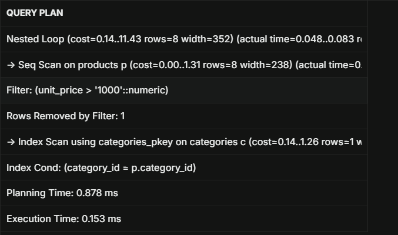 

```

**Запропоновані оптимізації:**
1. Скористатися складеним індексом products(category_id, unit_price) або products(unit_price). Зараз використовується Seq Scan, бо таблиця мала (9 рядків, фільтр відсіяв лише 1). На великих обсягах цей індекс дозволить виконувати Index Scan замість повного сканування.
2. Створити покривальний індекс INCLUDE (product_name), щоб запит виконувався через Index Only Scan без звернення до таблиці.
3. Підтримувати актуальну статистику (ANALYZE), щоб планувальник правильно оцінював кількість рядків. Крім того, Planning Time (0,878 ms) більший за Execution Time (0,153 ms), тому для частих запитів варто використовувати підготовлені запити (PREPARE).

### Створені індекси

**Індекс 1:**
```sql
CREATE INDEX idx_orders_customer_date ON orders(customer_id, order_date);

```
**Обґрунтування:** Прискорює з'єднання orders з customers та фільтрацію за датою (завдання 1.2, 3.2, 4.3). Також допомагає віконним функціям LAG/LEAD у 5.2 (PARTITION BY customer_id ORDER BY order_date), бо дані вже відсортовані й окреме сортування не потрібне.

**Індекс 2:**
```sql
CREATE INDEX idx_products_category_price ON products(category_id, unit_price);

```
**Обґрунтування:** Підтримує корельовані підзапити (3.1) та віконні функції з PARTITION BY category_id ORDER BY unit_price (5.1, 5.3). Також прискорює функцію get_category_stats, що фільтрує за категорією й діапазоном цін (6.3).

**Індекс 3:**
```sql
CREATE INDEX idx_customers_type_region ON customers(customer_type, region_id);

```
**Обґрунтування:** Допомагає у запитах, що групують або фільтрують клієнтів за типом і регіоном (1.2, 2.2, 6.1). Варто зазначити, що customer_type має низьку селективність (лише individual/company), тож ефект буде помітним переважно на великих таблицях.


## Порівняльний аналіз

### Ефективність різних підходів

**Завдання:** Знайти топ-5 найдорожчих товарів у кожній категорії

**Підхід 1: Віконні функції**
```sql
-- 1. Віконні функції
EXPLAIN ANALYZE
SELECT * FROM (
    SELECT p.product_name, c.category_name, p.unit_price,
           ROW_NUMBER() OVER (PARTITION BY c.category_id ORDER BY p.unit_price DESC) AS rn
    FROM products p
    JOIN categories c ON p.category_id = c.category_id
) ranked
WHERE rn <= 5;

```

**Підхід 2: Корельований підзапит**
```sql
-- 2. Корельований підзапит
EXPLAIN ANALYZE
SELECT p.product_name, c.category_name, p.unit_price
FROM products p
JOIN categories c ON p.category_id = c.category_id
WHERE (
    SELECT COUNT(*) FROM products p2
    WHERE p2.category_id = p.category_id AND p2.unit_price > p.unit_price
) < 5;

```

**Час виконання:**
- Віконні функції: [0.270 ms]
- Корельований підзапит: [0.369 ms]

**Висновок:** Віконні функції виконалися швидше. Вони обробляють таблицю за один прохід з розбиттям на партиції та нумерацією. Корельований підзапит для кожного рядка products повторно рахує кількість дорожчих товарів у категорії, тому кількість операцій зростає квадратично. На нашому малому наборі даних різниця мізерна, але на великих таблицях вона стане суттєвою. Індекс products(category_id, unit_price) зменшує вартість корельованого підзапиту, проте віконні функції залишаються простішими, читабельнішими та масштабованішими.


## Висновки

**Самооцінка**: [5]

**Обгрунтування**: Я виконала усі завдання трьох рівнів складності: з'єднання, агрегації, підзапити, віконні функції, матеріалізоване представлення, рекурсивний запит і функцію. Результати підтверджено скріншотами. Також я проаналізувала план виконання EXPLAIN ANALYZE, запропонувала оптимізації, створила три індекси з обґрунтуванням та порівняла два підходи до задачі top-N. Під час роботи я закріпила різницю між INNER і LEFT JOIN, умовами в ON та WHERE, а також принцип роботи віконних функцій.