# Лабораторна робота 1. Робота з СУБД PostgreSQL та основи SQL

## Загальна інформація

**Здобувач освіти:** [Зінькевич Олександра Василівна]
**Група:** [ІПЗ-31]
**Обраний рівень складності:** [3]

## Виконання завдань

### Список таблиць

```sql
-- Запит для отримання списку таблиць
SELECT table_name
FROM information_schema.tables
WHERE table_schema = 'public'
ORDER BY table_name;
```

Результат: У базі даних створено 8 основних таблиць: categories, customers, employees, order_items, orders, products, regions, suppliers.

Скріншот

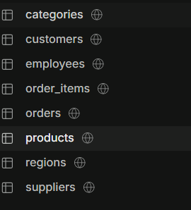


## Рівень 1

### Отримати всі записи з таблиці customers.

```sql
SELECT * FROM customers;
```

Результат: Отримано 15 записів клієнтів, включаючи як фізичних осіб, так і юридичні особи з різних міст України.

Скріншот

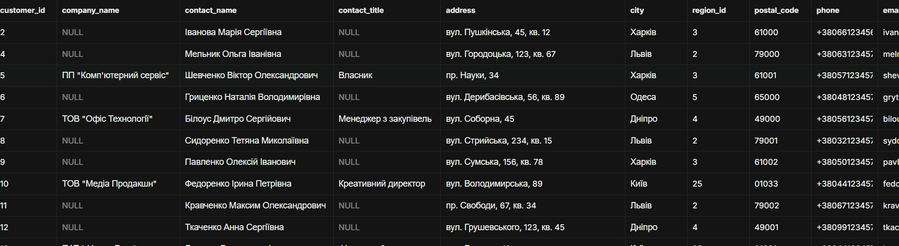
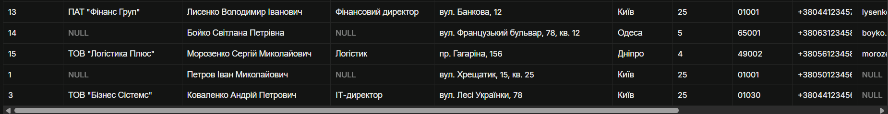


### Вивести назви товарів та їхні ціни

```sql
SELECT product_name, unit_price FROM products;
```

Результат: Отримано перелік усіх товарів із вказанням їхньої вартості

Скріншот

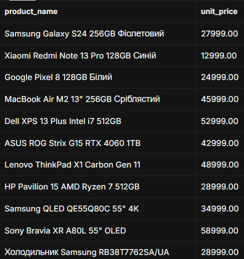
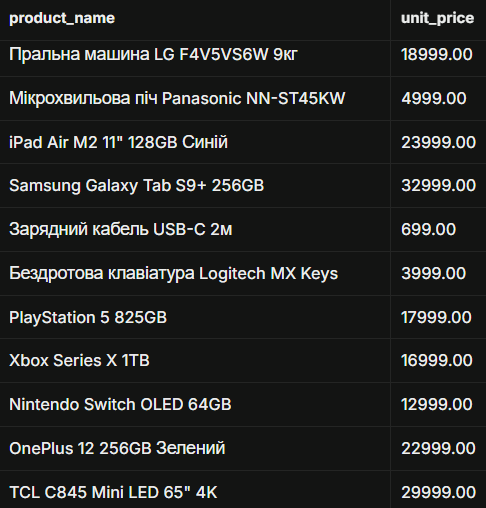
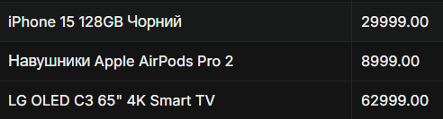


### Показати контактні дані співробітників

```sql
SELECT last_name, first_name, phone, email FROM employees;
```

Результат: Отримано список працівників з їхніми номерами телефонів та електронними поштами.

Скріншот

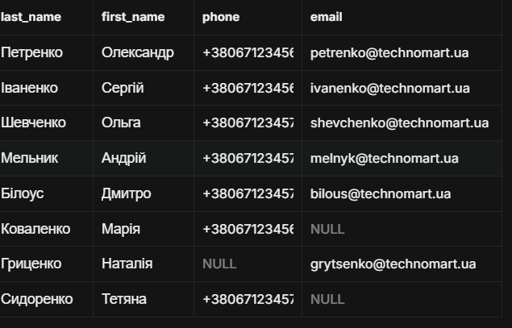


### Клієнти з міста Київ

```sql
SELECT * FROM customers WHERE city = 'Київ';
```

Результат: Знайдено клієнтів, що зареєстровані в місті Київ.

Скріншот

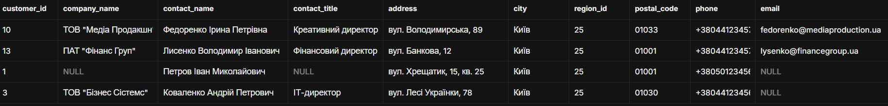


### Товари дорожчі за 25000 грн

```sql
SELECT * FROM products WHERE unit_price > 25000;
```

Результат: Отримано список товарів з ціною понад 25000 грн.

Скріншот

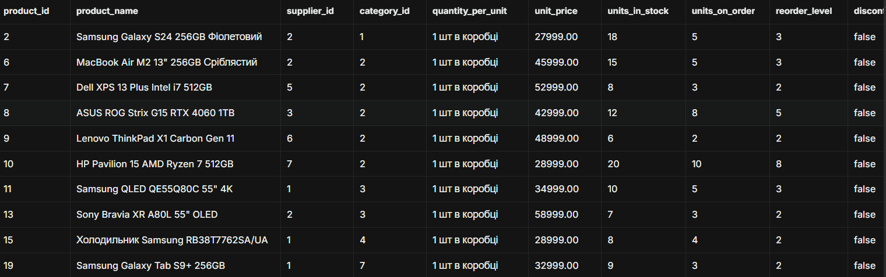
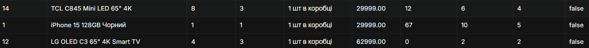


### Замовлення зі статусом 'delivered'

```sql
SELECT * FROM orders WHERE order_status = 'delivered';
```

Результат: Відфільтровано всі успішно доставлені замовлення.

Скріншот

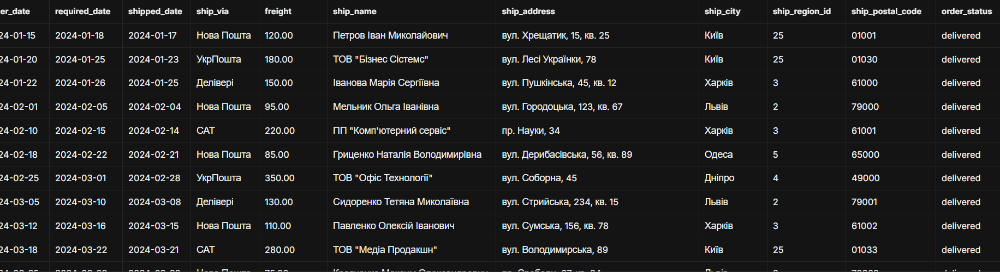
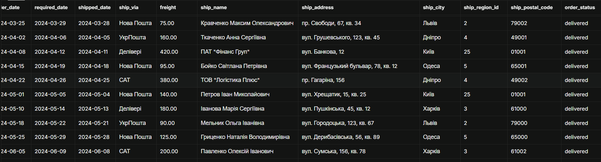
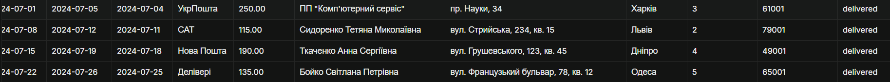


### Співробітники відділу продажів

```sql
SELECT * FROM employees WHERE title LIKE '%продаж%';
```

Результат: Отримано список співробітників, які працюють у відділі продажів.

Скріншот

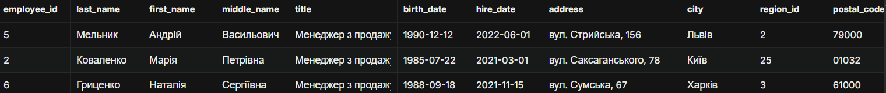

### Товари за зростанням ціни

```sql
SELECT * FROM products ORDER BY unit_price ASC;
```

Результат: Товари відсортовано від найдешевшого до найдорожчого.

Скріншот

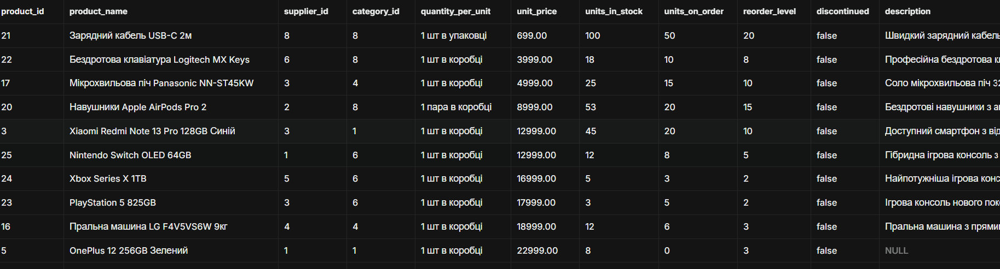
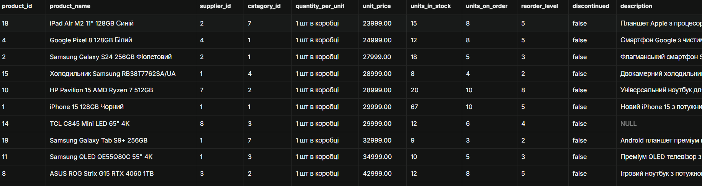
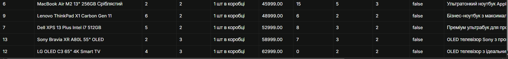


### Клієнти в алфавітному порядку

```sql
SELECT * FROM customers ORDER BY contact_name ASC;
```

Результат: Перелік клієнтів впорядковано за алфавітом (А-Я).

Скріншот

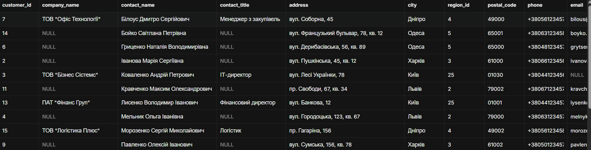
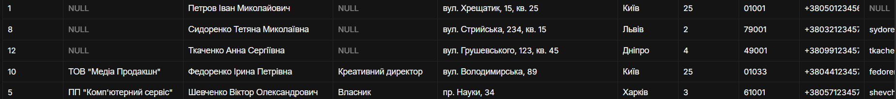


### Замовлення від найновіших до найстаріших

```sql
SELECT * FROM orders ORDER BY order_date DESC;
```

Результат: Замовлення відсортовано за датою у зворотному хронологічному порядку.

Скріншот

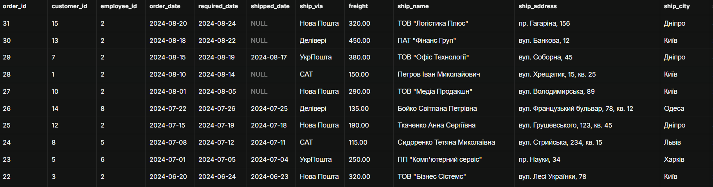
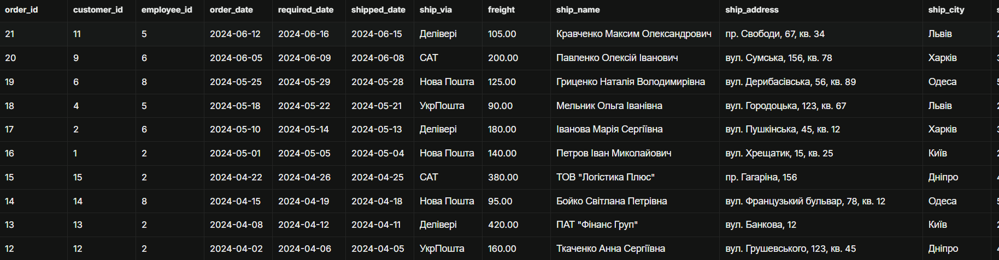
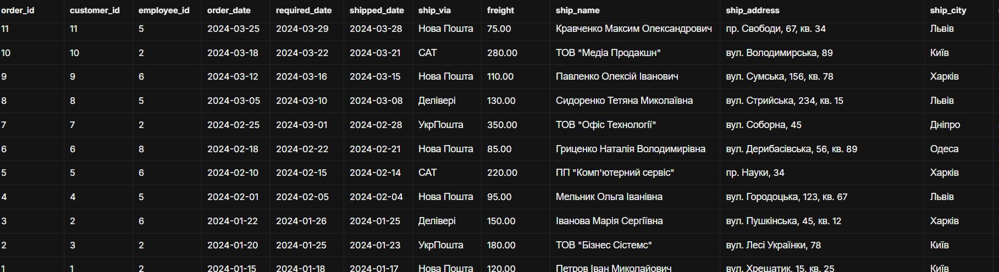


### Перші 10 найдорожчих товарів

```sql
SELECT * FROM products ORDER BY unit_price DESC LIMIT 10;
```

Результат: Отримано топ-10 товарів з найвищою ціною.

Скріншот

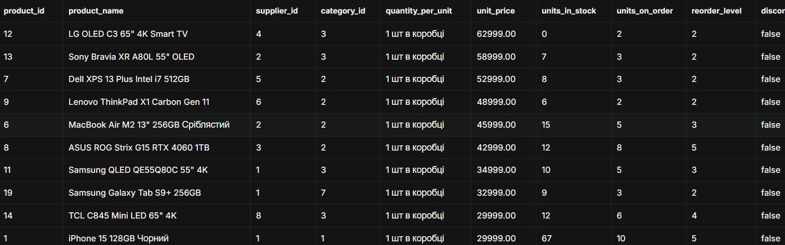


### 5 останніх замовлень

```sql
SELECT * FROM orders ORDER BY order_date DESC LIMIT 5;
```

Результат: Отримано 5 найновіших замовлень у системі.

Скріншот

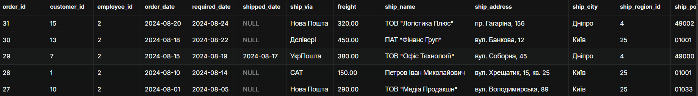


### Перші 8 клієнтів за алфавітом

```sql
SELECT * FROM customers ORDER BY contact_name ASC LIMIT 8;
```

Результат: Виведено перших 8 клієнтів за алфавітним списком.

Скріншот

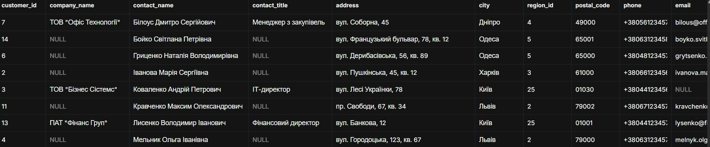


## Рівень 2

### Пошук клієнтів на ім'я Іван

```sql
-- Імена що починаються на "Іван"
SELECT * FROM customers WHERE contact_name like 'Іван%';
```

Результат: Знайдено всіх клієнтів, ім'я яких починається на 'Іван'.

Скріншот

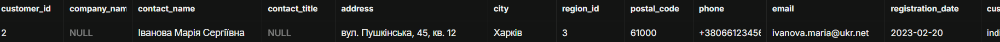


### Пошук телефонів у назві товарів

```sql
--Назви що містять в собі "phone" або "телефон"
SELECT * FROM products
WHERE product_name ilike '%phone%' or product_name ilike '%телефон%';
```

Результат: Отримано всі товари, які є телефонами або смартфонами.

Скріншот

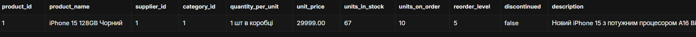


### Власне: Знайти всіх менеджерів

```sql
-- Знайти всіх менеджерів
SELECT * FROM employees WHERE title LIKE 'Менеджер%';
```

Результат: Отримано співробітників на посаді менеджера.

Скріншот

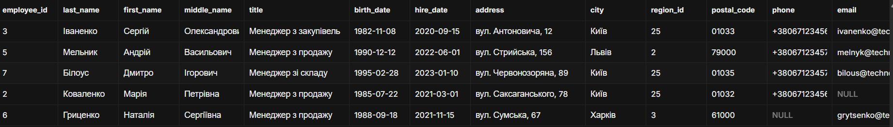


### Власне: Знайти усі замовлення що відправлялися Новою Поштою або УкрПоштою

```sql
-- Знайти усі замовлення що відправлялися Новою Поштою або УкрПоштою
SELECT * FROM orders WHERE ship_via LIKE '%Пошта';
```

Результат: Знайдено замовлення, відправлені Новою Поштою або УкрПоштою.

Скріншот

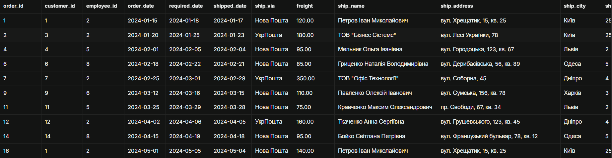
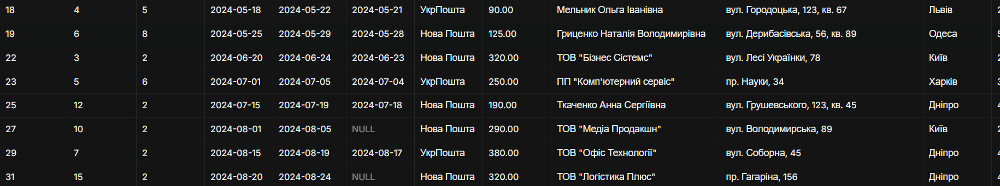


### Власне: Містить: товари з "Samsung"

```sql
-- Знайти усю техніку Samsung
SELECT * FROM products WHERE product_name LIKE '%Samsung%';
```

Результат: Виведено товари, назва яких містить "Samsung".

Скріншот

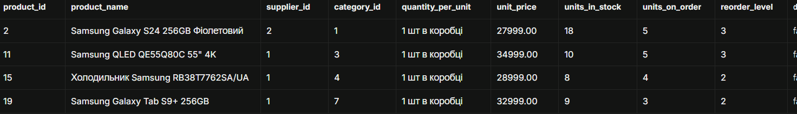


### Товари 15000–50000 грн

```sql
-- 1. Товари 15000–50000 грн
SELECT * FROM products WHERE unit_price > 15000 AND unit_price < 50000;
```

Результат: Отримано товари в ціновому діапазоні 15000–50000 грн.

Скріншот

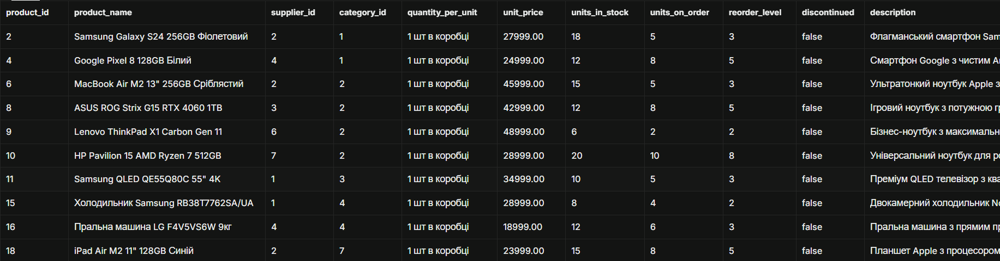
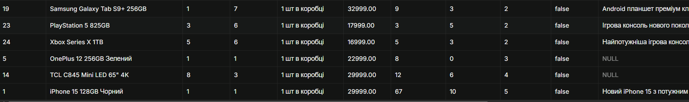


### Клієнти з Києва або Львова — юридичні особи

```sql
-- 2. Клієнти з Києва або Львова — юридичні особи
SELECT * FROM customers
WHERE (city = 'Київ' OR city = 'Львів') AND customer_type = 'company';
```

Результат: Знайдено компанії з Києва або Львова.

Скріншот

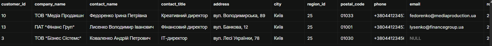


### Власне: Дорогі товари, яких менше 10

```sql
-- 3.1. Дорогі товари, яких менше 10
SELECT * FROM products
WHERE unit_price > 30000 AND units_in_stock < 10;
```

Результат: Виявлено дорогі товари з залишком менше 10 одиниць.

Скріншот

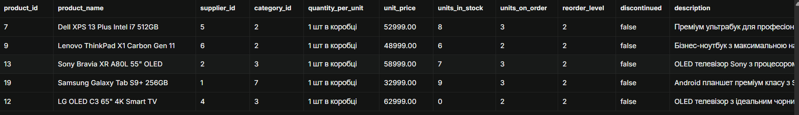


### Власне: Співробітники без email АБО без телефону

```sql
-- 3.2. Співробітники без email АБО без телефону
SELECT * FROM employees WHERE email IS NULL OR phone IS NULL;
```

Результат: Знайдено співробітників без email або телефону.

Скріншот

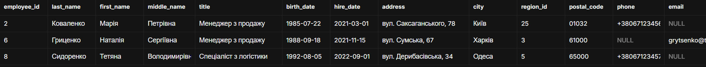


### Власне: Клієнти НЕ з Києва, які є компаніями

```sql
-- 3.3. Клієнти НЕ з Києва, які є компаніями
SELECT * FROM customers
WHERE NOT city = 'Київ' AND customer_type = 'company';
```

Результат: Отримано компанії не з Києва.

Скріншот

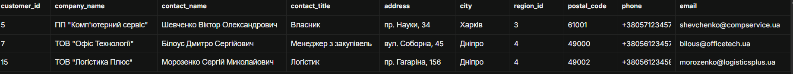


### Власне:  Товари в наявності, але не з категорії 1 та 2

```sql
-- 3.4. Товари в наявності, але не з категорії 1 та 2
SELECT * FROM products
WHERE units_in_stock > 0 AND category_id NOT IN (1, 2);
```

Результат: Виведено товари в наявності, що не належать до категорій 1 та 2.

Скріншот

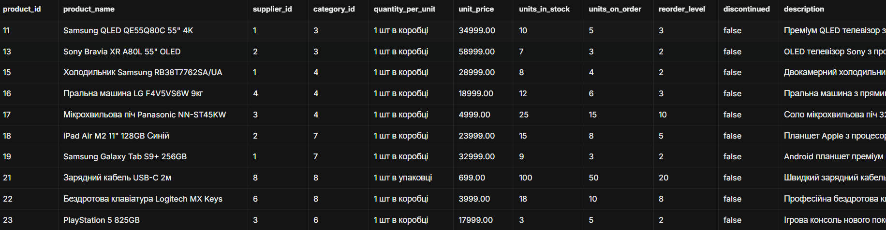
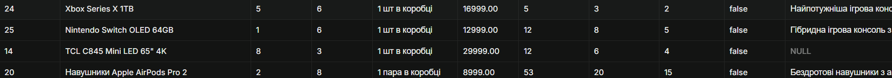


### Клієнти з Києва, Харкова, Одеси, Дніпра

```sql
-- 1. Клієнти з Києва, Харкова, Одеси, Дніпра
SELECT * FROM customers WHERE city IN ('Київ', 'Харків', 'Одеса', 'Дніпро');
```

Результат: Знайдено клієнтів з чотирьох міст.

Скріншот

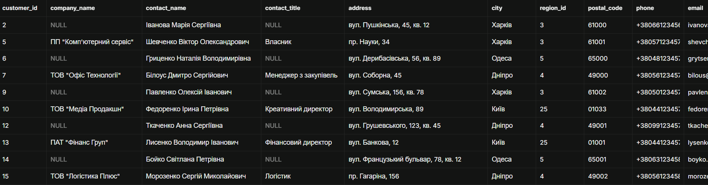
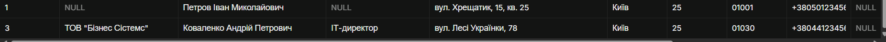


### Товари 10000–30000 грн

```sql
-- 2. Товари 10000–30000 грн
SELECT * FROM products WHERE unit_price BETWEEN 10000 AND 30000;
```

Результат: Отримано товари в діапазоні 10000–30000 грн.

Скріншот

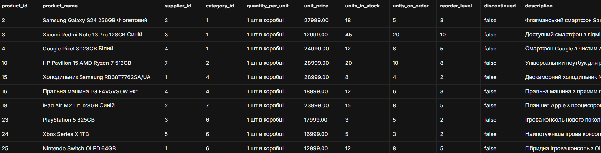
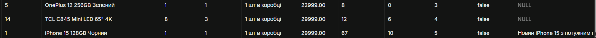


### Власне: IN

```sql
-- IN 1 :
SELECT * FROM products WHERE category_id IN (1, 3, 5);  -- кілька категорій
```

Результат: Виведено товари з категорій 1, 3, 5.

Скріншот

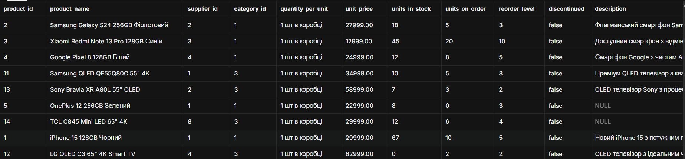


```sql
-- IN 2 :
SELECT * FROM orders WHERE order_status IN ('pending', 'processing');  -- активні
```

Результат: Знайдено замовлення зі статусами pending та processing.

Скріншот

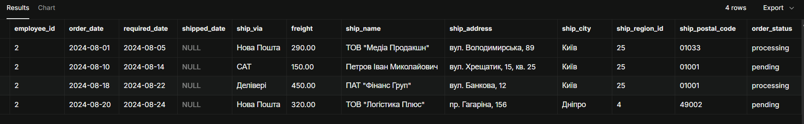


### Власне: BETWEEN

```sql
-- BETWEEN 1:
SELECT * FROM orders WHERE order_date BETWEEN '2024-01-01' AND '2024-03-30';
```

Результат: Отримано замовлення за першу чверть 2024 року.

Скріншот

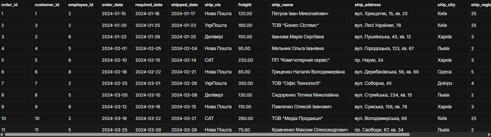


```sql
-- BETWEEN 2:
SELECT * FROM products WHERE units_in_stock BETWEEN 30 AND 100;
```

Результат: Виведено товари із залишком від 30 до 100 одиниць.

Скріншот

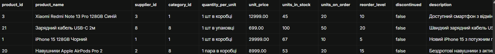


### Власне: IS NULL / IS NOT NULL

```sql
-- IS NULL / IS NOT NULL 1 :
SELECT * FROM customers WHERE company_name IS NULL;  -- фізособи
```

Результат: Знайдено фізичних осіб (без назви компанії).

Скріншот

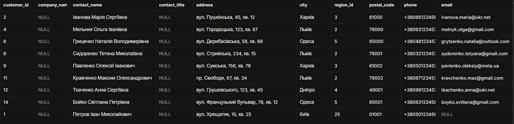


```sql
-- IS NULL / IS NOT NULL 2 :
SELECT * FROM products WHERE description IS NOT NULL;  -- з описом
```

Результат: Отримано товари, що мають опис.

Скріншот

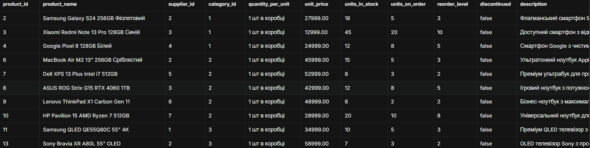
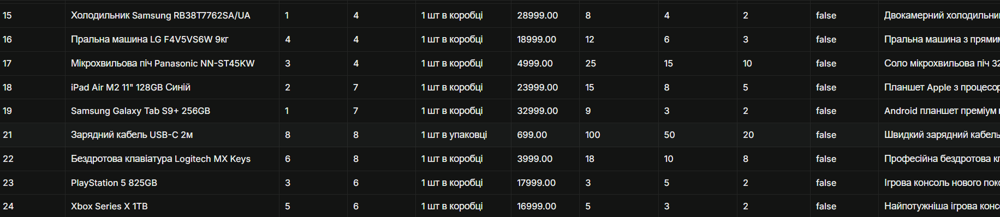


### LIKE + AND + OR

```sql
-- 1. LIKE + AND + OR
-- Мета: Знайти преміум-товари брендів Samsung або Apple,
--       які є в наявності на складі.
-- БІЗНЕС-ЛОГІКА: Відділ маркетингу формує вітрину найдорожчих
--                флагманів від топових брендів для реклами.
--                Дешеві моделі та товари не в наявності
--                не потрапляють у рекламну кампанію.
SELECT * FROM products
WHERE (product_name ILIKE '%samsung%' OR product_name ILIKE '%apple%')
  AND unit_price > 20000
  AND units_in_stock > 0;
```

Результат: Знайдено преміум-товари Samsung або Apple, що є в наявності.

Скріншот


### BETWEEN + IN

```sql
-- 2. BETWEEN + IN
-- Мета: Знайти товари середнього цінового сегмента (5000–30000)
--       у ключових категоріях магазину (1, 2, 3).
-- БІЗНЕС-ЛОГІКА: Відділ закупівель аналізує найбільш
--                конкурентний і масовий ринок — середній
--                ціновий сегмент основних товарних груп.
SELECT * FROM products
WHERE unit_price BETWEEN 5000 AND 30000
  AND category_id IN (1, 2, 3);
```

Результат: Виведено товари середнього цінового сегмента в ключових категоріях.

Скріншот


### IS NOT NULL + LIKE + AND

```sql
-- 3. IS NOT NULL + LIKE + AND
-- Мета: Знайти київських клієнтів з Gmail-адресою та
--       заповненим email.
-- БІЗНЕС-ЛОГІКА: Маркетинг готує email-розсилку для київських
--                клієнтів. Використовуємо тільки Gmail, щоб
--                не потрапити у спам-фільтри корпоративних
--                поштових серверів B2B-клієнтів.
SELECT * FROM customers
WHERE email IS NOT NULL
  AND email LIKE '%@gmail.com'
  AND city = 'Київ';
```

Результат: Знайдено клієнтів з Києва з email на gmail.com.

Скріншот


### NOT LIKE + BETWEEN + OR

```sql
-- 4. NOT LIKE + BETWEEN + OR
-- Мета: Знайти товари для переоцінки/розпродажу:
--       НЕ зарядні кабелі, і при цьому або в ціновому діапазоні
--       10000–50000, або накопичилися на складі (>50 шт.).
-- БІЗНЕС-ЛОГІКА: Керівництво шукає кандидатів на зниження ціни:
--                або середньо-преміум товари, або ті, що
--                залежалися на складі. Зарядні кабелі — дрібний
--                аксесуар, який у цьому аналізі не цікавить.
SELECT * FROM products
WHERE product_name NOT LIKE '%кабель%'
  AND (unit_price BETWEEN 10000 AND 25000 OR units_in_stock > 50);
```

Результат: Виявлено товари для переоцінки/розпродажу (не кабелі).

Скріншот


### IN + IS NULL + AND

```sql
-- 5. IN + IS NULL + AND
-- Мета: Знайти співробітників у Києві або Львові, у яких
--       заповнені І телефон, І email.
-- БІЗНЕС-ЛОГІКА: HR-аудит контактів для внутрішньої
--                комунікації. Потрібні тільки ті співробітники,
--                з ким можна зв'язатися обома каналами —
--                решта йдуть у список на дозаповнення.
SELECT * FROM employees
WHERE city IN ('Київ', 'Львів')
  AND phone IS NOT NULL
  AND email IS NOT NULL;
```

Результат: Отримано співробітників з Києва або Львова з повними контактами.

Скріншот


### Спочатку за категорією, потім ціна за спаданням

```sql
-- 1. Спочатку за категорією, потім ціна за спаданням
SELECT * FROM products
ORDER BY category_id ASC, unit_price DESC;
```

Результат: Товари відсортовано за категорією, потім за спаданням ціни.

Скріншот


### Клієнти: тип, місто, ім'я

```sql
-- 2. Клієнти: тип, місто, ім'я
SELECT * FROM customers
ORDER BY customer_type ASC, city ASC, contact_name ASC;
```

Результат: Клієнти впорядковано за типом, містом та ім'ям.

Скріншот


### Замовлення: статус, дата (новіші спочатку)

```sql
-- 3. Замовлення: статус, дата (новіші спочатку)
SELECT * FROM orders
ORDER BY order_status ASC, order_date DESC;

```

Результат: Замовлення відсортовано за статусом та датою.

Скріншот


### Пагінація: сторінка 1

```sql
-- Запити з OFFSET (пагінація)
-- Сторінка 1 (1-10) 
SELECT * FROM products ORDER BY product_name ASC LIMIT 10 OFFSET 0;
```

Результат: Отримано першу сторінку товарів (1-10).

Скріншот


### Пагінація: сторінка 2

```sql
-- Запити з OFFSET (пагінація)
-- Сторінка 2 (11-20)
SELECT * FROM products ORDER BY product_name ASC LIMIT 10 OFFSET 10;
```

Результат: Отримано другу сторінку товарів (11-20).

Скріншот


## Висновки

**Самооцінка**: [ваша оцінка роботи, 3-5]

**Обгрунтування**: [обґрунтування самооцінки]